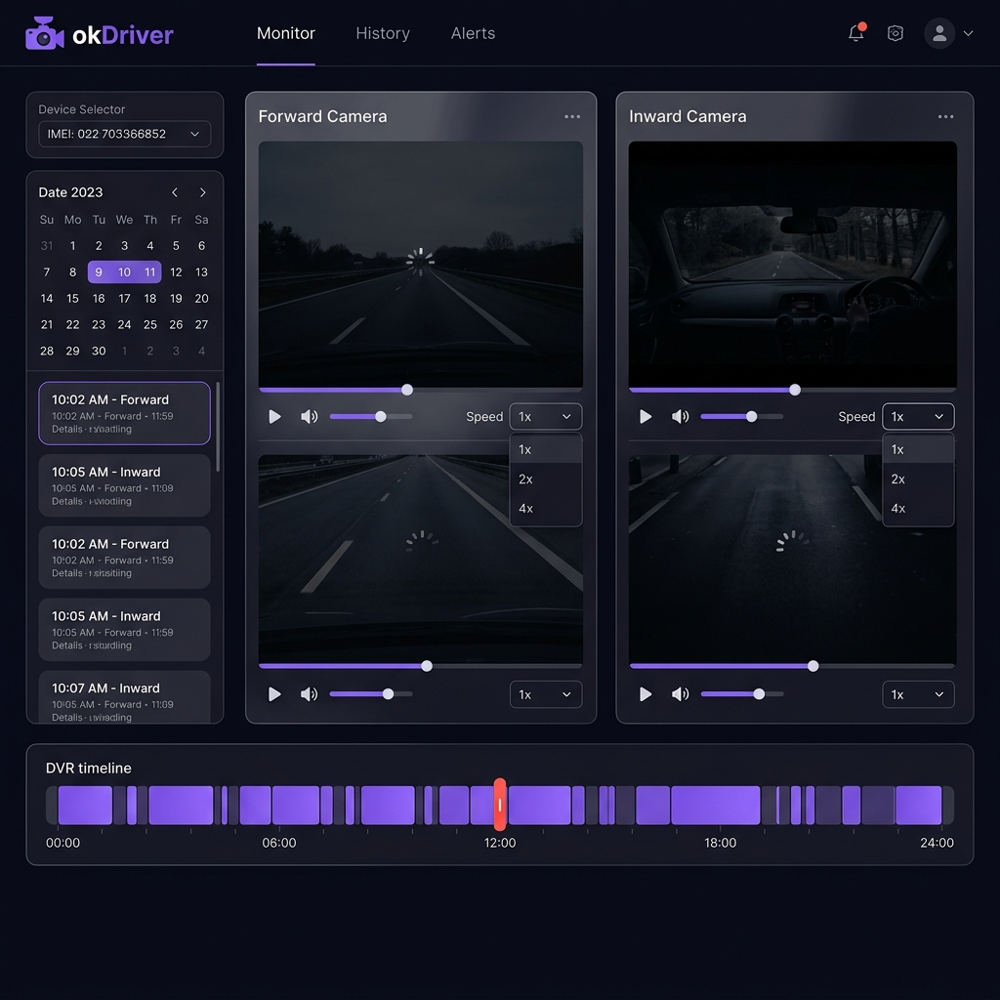
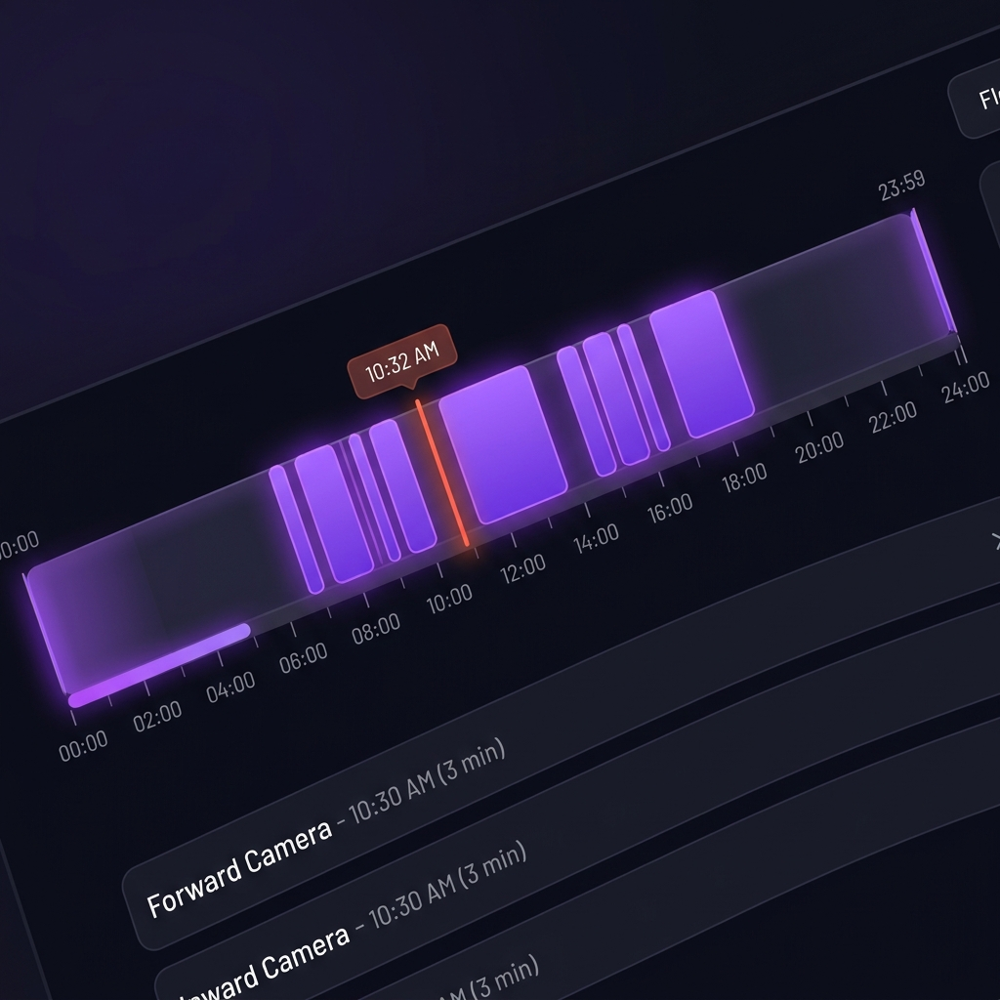

<](https://reactjs.org/)
[](https://vitejs.dev/)
[](https://developer.mozilla.org/en-US/docs/Web/JavaScript)
[](https://developer.mozilla.org/en-US/docs/Web/API/MediaSource)

> **Frontend-only** submission for the okDriver Full Stack Developer Assignment.
> Built to transform fragmented dashcam clips into a seamless, DVR-like review experience.

</div>

---

## 📸 Screenshots

### Full Dashboard View



### 24-Hour DVR Timeline



---

## ⚡ Quick Start

```bash
# 1. Clone the repo
git clone https://github.com/your-username/okdriver-frontend.git
cd okdriver-frontend

# 2. Install dependencies
npm install

# 3. Start the development server
npm run dev
```

Open **`http://localhost:5173`** in your browser.

> **No backend setup required.** The app uses the okDriver platform API directly, with a transparent mock-data fallback when the device is offline.

> **🔄 If you see a "Failed to Fetch" error or black video screen** — do a hard refresh: **`Ctrl + Shift + R`**. This clears browser cache and usually fixes both issues instantly.

> **⏳ Please be patient on first load** — the app fetches clip data from the API on startup. The timeline and player appear once data is ready (usually 2–5 seconds).

---

## 🗂️ Project Structure

```
frontend/
├── public/
│   ├── favicon.svg
│   ├── icons.svg
│   └── mockClips.json          ← 152 pre-built mock clips for offline demo
├── src/
│   ├── components/
│   │   ├── layout/             ← App shell, sidebar, nav
│   │   ├── player/
│   │   │   └── DvrPlayer.jsx   ← Video renderer + stall detector
│   │   ├── timeline/
│   │   │   └── TimelineBar.jsx ← 24-hour interactive scrubber
│   │   └── ui/                 ← Buttons, loaders, overlays
│   ├── hooks/
│   │   └── useDvrPlayback.js   ← Central state engine (the "brain")
│   ├── pages/
│   │   ├── HistoryMonitor.jsx  ← Main layout controller
│   │   └── Login.jsx
│   ├── services/               ← API client (axios + okDriver endpoints)
│   ├── store/                  ← Global context
│   └── utils/
│       └── hlsPlayer.js        ← Custom MSE streaming engine
├── package.json
└── vite.config.js
```

---

## ✨ Features

| Feature | Description |
|---|---|
| **🎬 Continuous DVR Playback** | Seamless auto-advance from one 3-minute clip to the next, just like a DVR |
| **📅 24-Hour Interactive Timeline** | Visual scrubber mapping 150+ clips onto a single 24-hour axis |
| **📷 Dual Camera Synchronization** | Side-by-side Forward & Inward camera playback, perfectly synced |
| **🖱️ Click-to-Seek Navigation** | Click any point on the timeline to jump to the exact timestamp |
| **⚡ Variable Playback Speed** | 1×, 2×, and 4× speed controls |
| **🔄 Mock Data Fallback** | Fully functional offline demo — no physical dashcam required |
| **🛡️ MSE Stall Auto-Recovery** | Self-healing decoder that recovers from corrupted MPEG-TS streams |

---

## 🏗️ Architecture

The application follows a strict **separation of concerns** between state management and UI rendering:

```
┌─────────────────────────────────────────────────────────────┐
│                    HistoryMonitor.jsx                        │
│            (Layout Controller — dual pane + sidebar)         │
└──────────────────────────┬──────────────────────────────────┘
                           │
            ┌──────────────▼──────────────┐
            │      useDvrPlayback.js       │
            │  (Central State Engine)      │
            │  • Clip queue management     │
            │  • API polling & fallback    │
            │  • Timeline math             │
            │  • Timezone normalization    │
            └──────┬──────────────┬───────┘
                   │              │
     ┌─────────────▼──┐    ┌──────▼──────────┐
     │  DvrPlayer.jsx  │    │  TimelineBar.jsx │
     │  (Video UI)     │    │  (24-hr Scrubber)│
     └────────┬────────┘    └─────────────────┘
              │
     ┌────────▼────────┐
     │   hlsPlayer.js   │
     │  (MSE Engine)    │
     │  Raw .ts → MSE   │
     └─────────────────┘
```

---

## 🌐 API & Backend

**No backend was built.** The okDriver platform provides a third-party API (`http://smart.okdriver.in:5000`) that this frontend consumes directly:

| Endpoint | Purpose |
|---|---|
| `GET /api/playback/videos/{imei}` | Fetch clip list for a device & date |
| `POST /api/playback/upload/{clipId}` | Trigger clip upload from dashcam |
| `GET /api/playback/status/{clipId}` | Poll upload completion status |
| `GET /clip-url` | Stream the raw `.ts` video file |

The API returns `Access-Control-Allow-Origin: *`, so no proxy configuration is needed.

---

## 🎭 Mock Data Fallback

Since physical dashcam hardware isn't always available, a **transparent fallback** is built in:

```
App Startup
    │
    ▼
GET /api/playback/videos/{imei}
    │
    ├── Returns clips ──────────────► Live Mode ✅
    │
    └── Returns [] or network error ► Mock Mode 🎭
                                          │
                                          ▼
                                  Fetch /mockClips.json
                                  (152 pre-built clips)
                                          │
                                          ▼
                                  Skip upload polling
                                  All clips → "ready"
                                          │
                                          ▼
                                  Full UI demo runs ✅
```

**Every feature runs identically in mock mode** — continuous playback, dual cameras, timeline scrubbing, click-to-seek — all without a live device.

---

## 🔬 Engineering Deep Dives

### 1. The Invisible Timeline Problem

**Problem:** 150+ clips loaded but the timeline appeared completely blank.

**Root causes:**
1. **Timezone mismatch** — API returned UTC timestamps but the UI rendered in local time, pushing all clips off-screen
2. **Sub-pixel rendering** — A 3-minute clip is ~0.2% of 24 hours = **1.5px** on a 1080p screen. CSS anti-aliasing erased them

**Solution:**
- `normalizeClip()` interceptor recalculates all timestamps to local timezone
- Adjacent clips are **fused into continuous bands** to achieve visible width
- `min-width` CSS guarantees isolated clips are never invisible

---

### 2. Browser Decoder Freeze (MSE Stall Detector)

**Problem:** Videos randomly froze mid-playback. UI showed "Playing" but `currentTime` stopped. Native `ended` event never fired.

**Root cause:** Raw MPEG-TS files from hardware dashcams have misaligned audio/video tracks. If a keyframe drops over the network, the browser decoder pipeline deadlocks waiting for a frame that never arrives.

**Solution — Stall Detector in `DvrPlayer.jsx`:**

```
Every 500ms (while playing):
    │
    ▼
Compare currentTime to previous tick
    │
    ├── Time advanced → ✅ Normal
    │
    └── Time SAME for 2 full seconds (4 ticks)
            │
            ▼
        STALL DETECTED
            │
            ▼
        video.currentTime += 0.1s  ← "microscopic nudge"
            │
            ▼
        Decoder flushes corrupt buffer
        Jumps to next valid I-Frame
        Playback resumes instantly ✅
```

---

### 3. Continuous Playback Failures

**Problem:** First clip played fine; auto-advance to the next clip failed.

**Root cause:** The custom `hlsPlayer.js` chunk-appending loop terminated at EOF but never called `mediaSource.endOfStream()`, so the browser never fired the `ended` event.

**Fix:** Added explicit `readOffset >= fileSize` check in the `updateend` listener → calls `endOfStream()` → triggers `ended` → clip queue advances correctly.

---

### 4. React State vs. Native DOM Event Conflict

**Problem:** Play/pause buttons occasionally became unresponsive or caused infinite re-render loops.

**Root cause:** React's `playState` and the native `<video>` DOM state competed for truth.

**Fix — Strict unidirectional data flow:**
- Native `onPlay` / `onPause` DOM events → **read-only** listeners that update React state
- `useEffect` watches React state changes → issues programmatic `video.play()` / `video.pause()` commands
- One direction only: DOM → React state → DOM command. Never circular.

---

## 🛠️ Tech Stack

| Technology | Version | Purpose |
|---|---|---|
| **React** | 19 | UI framework |
| **Vite** | 8 | Build tool & dev server |
| **React Router** | 7 | Client-side routing |
| **Axios** | 1.x | HTTP API client |
| **Day.js** | 1.x | Date/time manipulation |
| **MediaSource Extensions** | Native | Raw MPEG-TS streaming |
| **HLS.js** | 1.x | Adaptive streaming (fallback) |

---

## 📋 Available Scripts

```bash
npm run dev       # Start development server (localhost:5173)
npm run build     # Build for production
npm run preview   # Preview production build locally
npm run lint      # Run ESLint
```

---

## 🎯 Project Significance

For fleet operations, investigators manually sift through **hundreds of isolated 3-minute files** to find a single incident — an incredibly tedious process. This module solves that by:

1. **Weaving fragments** — Stitches hundreds of 3-minute clips into one continuous visual timeline
2. **Instant navigation** — Click any second of the day to jump directly to that footage
3. **Dual-camera sync** — Forward + Inward cameras stay locked in sync throughout playback
4. **Self-healing** — MSE stall detection ensures uninterrupted playback even with corrupted hardware streams

The result: what previously took **minutes of manual file hunting** now takes a **single click**.

---

<div align="center">

Built for the **okDriver Full Stack Developer Assignment**

*Developed by Somya Tomar*

</div>
]]>
